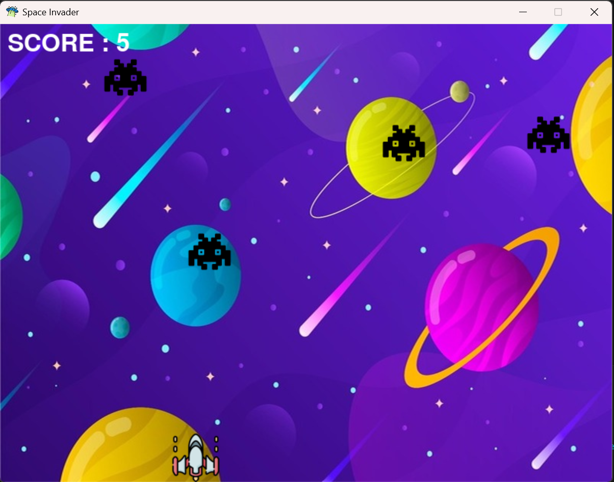

# 🚀 Space Invader Game

A classic **Space Invader** arcade game built using **Python** and **Pygame**. This project was developed to strengthen my understanding of game development concepts such as event handling, collision detection, animations, and object movement.

---

## 🎮 Features

- Player spaceship movement
- Multiple enemy ships
- Bullet firing system
- Collision detection
- Live score tracking
- Background music and sound effects
- Game Over screen
- Random enemy spawning
- Smooth gameplay using the Pygame game loop

---

## 🛠️ Built With

- Python 3
- Pygame
- PyInstaller (for executable)

---

## 📸 Screenshots


.png)


---

## 🎮 Controls

| Key | Action |
|------|--------|
| ← | Move Left |
| → | Move Right |
| ↑ | Move Up |
| ↓ | Move Down |
| Space | Fire Bullet |

---

## 🚀 How to Run

### Method 1: Using Python

1. Clone the repository

```bash
git clone https://github.com/pranavchauhan0102-ui/Space-Invader-Game.git
